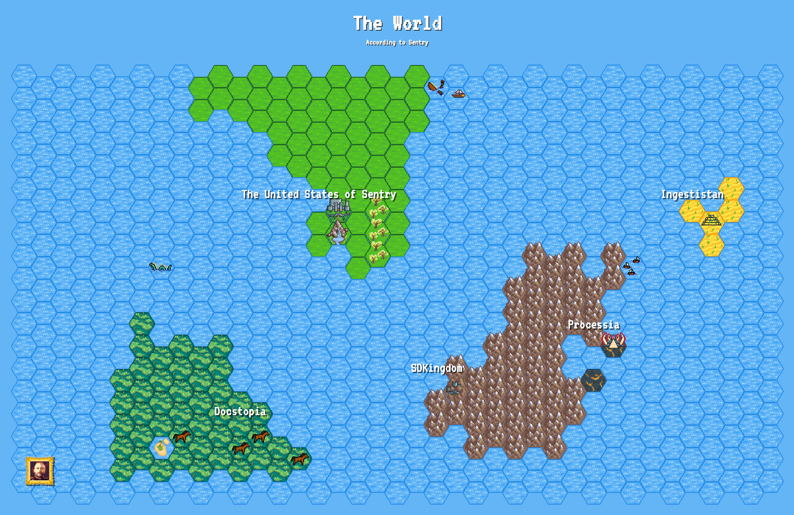

# The World -  According to Sentry



This is a project for Sentry Hackweek 2023 and reads data from the Sentry GitHub organization and visualizes it as a map.


## Backend

The FastAPI backend reads data from the GitHub organization and caches it in a redis server. One API endpoint is provided to give all the data to the frontend.

For running the backend do the following:

```
cd backend
./run.sh
```

This will:
- create a virtual environment, 
- install all the depencencies, 
- start `redis-server`
- Run the backend on `http://localhost:8000/`

### Prerequisites

You need to have `redis-server` and Python >= 3.10 installed on your system.

You also need to set a GitHub access token in an environment variable called `GITHUB_ACCESS_TOKEN`.

### Refreshing the cache

When the backend starts it will read all data from GitHub and will cache it in redis. 

To clear the cache call this URL: `http;//localhost:8000/clear-cache`. (This then needs a restart of the backend to load new data.)

To refresh the cach call this URL: `http;//localhost:8000/reload-data`. This will clear the cache and read all the data again from GitHub. Depending on the size of your organization this will take quite some time and the backend will eventually run into a timeout.

## Frontend

The Frontend is a simple HTML file, connecting to the backend to retrieve all the data and then rendering a map on a HTML canvas.

For running the frontend do the following:

```
cd frontend
./run.sh
```

This will: 
- Start a simple Python http server on `http://localhost:9000/`
- Load the frontend 

### Prerequisites

As this starts a Python http server, you need to have Python installed to run the frontends run script.

